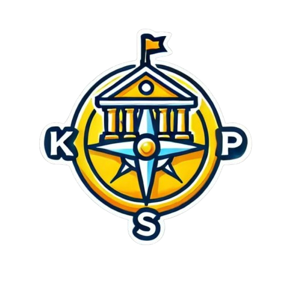

<p align="center">
  
</p>

<h1 align="center">🎓 KompasKampus</h1>
<p align="center"><em>
Website rekomendasi program studi UII untuk membantu calon mahasiswa menentukan pilihan terbaik dan meningkatkan peluang diterima.
</em></p>

---

## 📖 Tentang KompasKampus

KompasKampus adalah platform web yang memberikan rekomendasi program studi Universitas Islam Indonesia (UII) secara akurat. Dengan analisis data dan fitur personalisasi, aplikasi ini bertujuan memudahkan calon mahasiswa mendapatkan referensi jurusan yang paling sesuai dengan minat, bakat, serta peluang diterima di UII.

---

## 🚀 Fitur Utama

### 🧑‍💻 Tes Eligibilitas  
Tes kelayakan berdasarkan data dan minatmu untuk mendapatkan rekomendasi program studi terbaik.

### 🎯 Rekomendasi Program Studi  
Dapatkan rekomendasi jurusan UII yang paling cocok berdasarkan profil dan preferensi kamu.

### 📊 Simulasi & Analisis Peluang  
Simulasikan dan analisis peluang lolos seleksi program studi secara lebih terukur.

### 🗂️ Info Lengkap Jurusan  
Lihat detail jurusan, prospek karir, statistik penerimaan, serta info akreditasi.

### 🏆 Info Beasiswa  
Cari dan telusuri berbagai jenis beasiswa di UII, termasuk syarat, jadwal, dan benefitnya.

### 📰 Berita & Update Kampus  
Dapatkan update terbaru seputar event, timeline, pengumuman, dan seleksi di UII.

### 📝 Panduan & Tips Seleksi  
Dapatkan panduan memilih jurusan dan tips sukses lolos seleksi masuk UII.

### 🔎 Fitur Pencarian & Filter  
Temukan jurusan, beasiswa, atau informasi lain dengan mudah melalui fitur pencarian dan filter.

### 💾 Bookmark Beasiswa  
Simpan beasiswa favoritmu agar mudah diakses dan dipantau deadline-nya.

---

## 🌟 Visi

Menjadi platform terdepan yang membantu calon mahasiswa memilih program studi secara cerdas & meningkatkan peluang diterima di UII.

---

## 🛠️ Teknologi

KompasKampus dibangun menggunakan:
- HTML
- CSS
- PHP
- JavaScript

---

## 🚀 Cara Instalasi & Penggunaan

1. **Clone Repository**
   ```bash
   git clone https://github.com/aviitfbrsyh/KompasKampus.git
   ```
2. **Setup Web Server**  
   Pastikan kamu punya XAMPP/Laragon/LAMP, lalu letakkan folder ini di direktori web server (`htdocs`, dll).
3. **Akses Website**  
   Buka browser dan akses `http://localhost/KompasKampus` (atau path sesuai setup kamu).
4. **Konfigurasi Database**  
   Jika menggunakan database, sesuaikan konfigurasi di file PHP (`config.php`).

---

## 📄 Lisensi

Proyek ini berada di bawah lisensi [MIT](LICENSE).

---

<p align="center">
  Made with ❤️ untuk Mahasiswa UII oleh K Team
</p>
